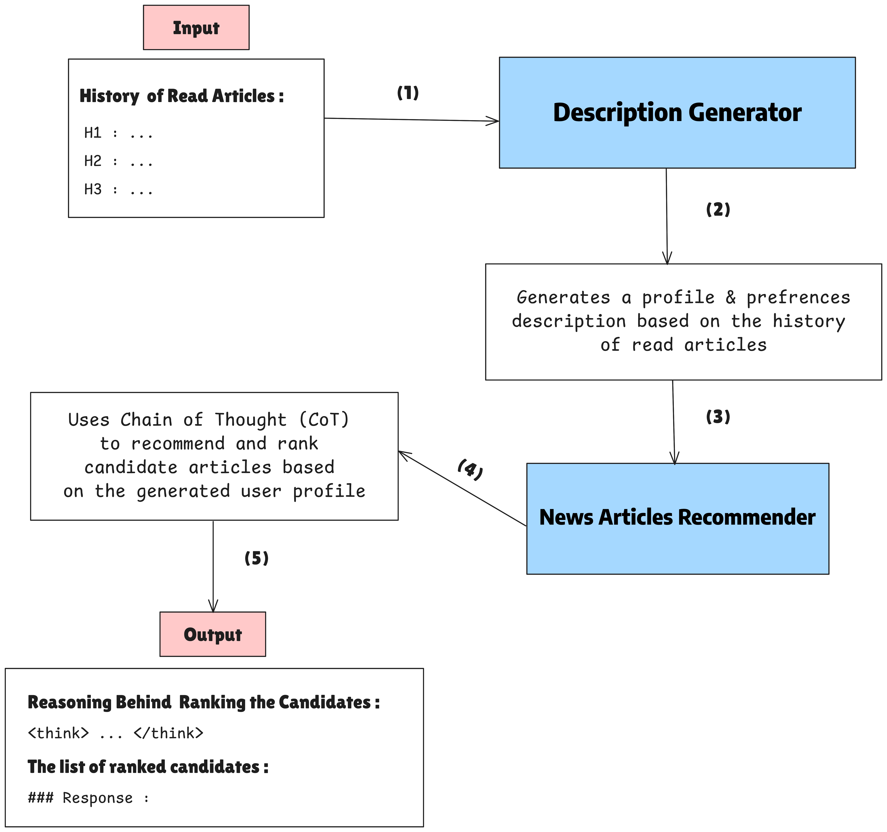

# Exploring DeepSeek-R1’s Reasoning Capabilities for News Recommendation

We propose an approach that seeks to explore and exploit DeepSeek-R1’s reasoning capabilities and apply them to news recommendation. Our method begins with a user profile generation stage, where we construct a descriptive user profile. We then leverage Chain-of-Thought (CoT) and step-by-step reasoning capabilities of DeepSeek-R1 to rank ten candidate articles for each user.

<p align="center">  
    
</p>
To execute the project, follow these steps :

1. Install all the packages listed in the `requirements.txt` file into your environment.
2. Set up your tokens :

```json

"general" :
    {
        "HGF":"YOUR HUGGING FACE TOKEN",
        "WNB":"YOUR WNB TOKEN"
    }

```
3. Preprocess the data . Run the notebook  : `1-Preprocess-Data.ipynb`
4. Generate descriptions. Run the notebook : `2-Description-generator.ipynb`
5. Build the recommender. Run the notebook  : `3-Recommender-generator-cot.ipynb`
6. Evaluate the results. Run the notebook : `Evaluation.ipynb`


Or you can test the framework without fine-tuning it by directly running the notebook `finalFrameWork.ipynb`

## Recommendation Performance Comparison:

| Model               | MRR            | nDCG@5         | nDCG@10        |
|---------------------|----------------|----------------|----------------|
| **Simple Model**    |                |                |                |
| Random              | 30.30±1.17     | 37.41±1.99     | 46.22±1.09     |
| MostPop             | 34.99±0.91     | 41.90±1.30     | 49.77±1.01     |
| TopicPop            | 39.35±0.07     | 44.39±0.52     | 53.59±1.05     |
| **Deep Model**      |                |                |                |
| LSTUR               | 43.76±0.30     | 47.84±0.21     | 57.00±0.23     |
| DKN                 | 42.31±0.50     | 46.31±0.37     | 55.88±0.18     |
| NAML                | 43.12±0.64     | 47.30±0.29     | 56.51±0.32     |
| NPA                 | 43.16±0.40     | 46.97±0.47     | 56.37±0.32     |
| NRMS                | 43.60±0.60     | 46.80±0.55     | 56.44±0.30     |
| **Prompt LLM**      |                |                |                |
| IO-LLM-rec-3.5      | 38.55±0.15     | 40.35±0.38     | 52.74±0.21     |
| CoT-LLM-rec-3.5     | 39.32±0.14     | 41.94±0.31     | 53.92±0.27     |
| IO-LLM-rec-4        | 42.14±0.12     | 45.96±0.30     | 55.81±0.15     |
| CoT-LLM-rec-4       | 44.01±0.19     | 48.02±0.34     | 57.12±0.18     |
| **RecPrompt**       |                |                |                |
| IO-LLM rec-3.5     | 39.53±0.14     | 42.00±0.33     | 53.56±0.25     |
| CoT-LLM rec-3.5    | 41.55±0.23     | 45.21±0.20     | 56.07±0.29     |
| IO-LLM rec-4       | 48.22±0.34     | 50.90±0.29     | 60.19±0.29     |
| CoT-LLM rec-4      | 48.65±0.53     | 52.36±0.43     | 60.73±0.24     |
| **DeepSeekR1**      |                |                |                |
| OurFramework        | 44.43±0.41     | 47.15±0.52     | 57.37±0.32     |
